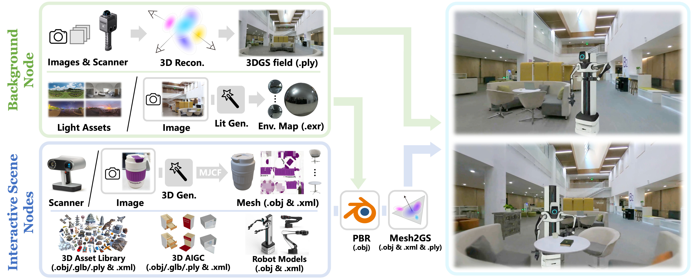

# DISCOVERSE: Efficient Robot Simulation in Complex High-Fidelity Environments

<div align="center">

[](https://arxiv.org/abs/2507.21981)
[](https://air-discoverse.github.io/)
[](LICENSE)
[](https://www.python.org/)
[](#docker-quick-start)

https://github.com/user-attachments/assets/78893813-d3fd-48a1-8bb4-5b0d87bf900f

*A unified, modular, open-source 3DGS-based simulation framework for Real2Sim2Real robot learning*
</div>

[中文文档](README_zh.md)

<div align="center">
<h1>
🎉 DISCOVERSE Accepted by IROS 2025!
</h1>
</div>

Our paper "DISCOVERSE: Efficient Robot Simulation in Complex High-Fidelity Environments" has been accepted by IEEE/RSJ International Conference on Intelligent Robots and Systems (IROS) 2025.


## 📦 Installation & Quick Start

### Quick Start

1. Clone repository
```bash
# Install Git LFS (if not already installed)
## Linux
curl -s https://packagecloud.io/install/repositories/github/git-lfs/script.deb.sh | sudo bash
sudo apt-get install git-lfs

## macOS using Homebrew
brew install git-lfs

git clone https://github.com/TATP-233/DISCOVERSE.git
cd DISCOVERSE
```

2. Choose installation method
```bash
conda create -n discoverse python=3.10 # >=3.8 is ok
conda activate discoverse
pip install -e .

## Auto-detect and download required submodules
python scripts/setup_submodules.py

## Verify installation
python scripts/check_installation.py
```

### Installation by Use Case

#### Scenario 1: Learning Robot Simulation Basics
```bash
pip install -e .  # Core functionality only
```
**Includes**: MuJoCo, OpenCV, NumPy and other basic dependencies

#### Scenario 2: LiDAR SLAM
```bash
pip install -e ".[lidar,visualization]"
```
- **Includes**: Taichi GPU acceleration, LiDAR simulation, visualization tools
- **Function**: High-performance LiDAR simulation with Taichi GPU acceleration
- **Dependencies**: `taichi>=1.6.0`
- **Use Cases**: Mobile robot SLAM, LiDAR sensor simulation, point cloud processing

#### Scenario 3: Robotic Arm Imitation Learning
```bash
pip install -e ".[act_full]"
```
- **Includes**: ACT algorithm, data collection tools, visualization
- **Function**: Imitation learning, robot skill training, policy optimization
- **Dependencies**: `torch`, `einops`, `h5py`, `transformers`, `wandb`
- **Algorithms**: Other algorithms available with [diffusion-policy] and [rdt]

#### Scenario 4: High-Fidelity Visual Simulation
```bash
pip install -e ".[gaussian-rendering]"
```
- **Includes**: 3D Gaussian Splatting, PyTorch
- **Function**: Photorealistic 3D scene rendering with real-time lighting
- **Dependencies**: `torch>=2.0.0`, `torchvision>=0.14.0`, `plyfile`, `PyGlm`
- **Use Cases**: High-fidelity visual simulation, 3D scene reconstruction, Real2Sim pipeline

### Module Feature Overview

| Module | Install Command | Function | Use Cases |
|--------|-----------------|----------|-----------|
| **Core** | `pip install -e .` | Core simulation | Learning, basic development |
| **LiDAR** | `.[lidar]` | High-performance LiDAR simulation | SLAM, navigation research |
| **Rendering** | `.[gaussian-rendering]` | 3D Gaussian Splatting rendering | Visual simulation, Real2Sim |
| **GUI** | `.[xml-editor]` | Visual scene editing | Scene design, model debugging |
| **ACT** | `.[act]` | Imitation learning algorithm | Robot skill learning |
| **Diffusion Policy** | `.[diffusion-policy]` | Diffusion model policy | Complex policy learning |
| **RDT** | `.[rdt]` | Large model policy | General robot skills |
| **Hardware Integration** | `.[hardware]` | RealSense+ROS | Real robot control |

### Docker Quick Start

We provide Docker installation method.

#### 1. Install NVIDIA Container Toolkit:
```bash
# Set up repository
distribution=$(. /etc/os-release;echo $ID$VERSION_ID) \
    && curl -s -L https://nvidia.github.io/nvidia-docker/gpgkey | sudo apt-key add - \
    && curl -s -L https://nvidia.github.io/nvidia-docker/$distribution/nvidia-docker.list | sudo tee /etc/apt/sources.list.d/nvidia-docker.list

# Update and install
sudo apt-get update
sudo apt-get install -y nvidia-container-toolkit nvidia-docker2

# Restart Docker service
sudo systemctl restart docker
```

### 2. Build Docker Image

- Download pre-built Docker image
    
    Baidu Netdisk: https://pan.baidu.com/s/1mLC3Hz-m78Y6qFhurwb8VQ?pwd=xmp9
    
    Currently updated to v1.8.6. After downloading the .tar file, use the docker load command to load the docker image.
    
    Replace `discoverse_tag.tar` below with the actual downloaded image tar file name.

    ```bash
    docker load < discoverse_tag.tar
    ```

- Or build from `Dockerfile`
    ```bash
    git clone https://github.com/TATP-233/DISCOVERSE.git
    cd DISCOVERSE
    python scripts/setup_submodules.py --module gaussian-rendering
    docker build -f docker/Dockerfile -t discoverse:latest .
    ```
    `Dockerfile.vnc` is a configuration version that supports VNC remote access. It adds VNC server support on top of `docker/Dockerfile`, allowing you to remotely access the container's graphical interface through a VNC client. This is particularly useful for remote development or environments without a local display server. If needed, change `docker build -f docker/Dockerfile -t discoverse:latest .` to `docker build -f docker/Dockerfile.vnc -t discoverse:latest .`

### 3. Create Docker Container

```bash
# Run with GPU support
docker run -dit --rm --name discoverse \
    --gpus all \
    -e DISPLAY=$DISPLAY \
    -v /tmp/.X11-unix:/tmp/.X11-unix \
    discoverse:latest
# Note: Replace `latest` with the actual docker image tag (e.g., v1.8.6).

# Set visualization window permissions
xhost +local:docker

# Enter container terminal
docker exec -it discoverse bash

# Test run
python3 discoverse/examples/active_slam/camera_view.py
```

## 📷 High-Fidelity Rendering Setup

For high-fidelity 3DGS rendering functionality, if you don't need high-fidelity rendering or are using docker installation, you can skip this section.

### 1. CUDA Installation
Install CUDA 11.8+ from [NVIDIA's official site](https://developer.nvidia.com/cuda-toolkit-archive), choose the corresponding CUDA version based on your graphics card driver.

### 2. 3DGS Dependencies
```bash
# Install Gaussian Splatting requirements
pip install -e ".[gaussian-rendering]"

# Build diff-gaussian-rasterization
cd submodules/diff-gaussian-rasterization/

# Apply patches
sed -i 's/(p_view.z <= 0.2f)/(p_view.z <= 0.01f)/' cuda_rasterizer/auxiliary.h
sed -i '361s/D += depths\[collected_id\[j\]\] \* alpha \* T;/if (depths[collected_id[j]] < 50.0f)\n        D += depths[collected_id[j]] * alpha * T;/' cuda_rasterizer/forward.cu

# Install
cd ../..
pip install submodules/diff-gaussian-rasterization
```

### 3. Download 3DGS Models

- [Baidu Netdisk](https://pan.baidu.com/s/1y4NdHDU7alCEmjC1ebtR8Q?pwd=bkca) 
- [Tsinghua Cloud](https://cloud.tsinghua.edu.cn/d/0b92cdaeb58e414d85cc/)

.ply model files are large, choose only the models you need.

Place in the `models/3dgs` directory as follows:
```
models/
├── meshes/          # Mesh geometries
├── textures/        # Material textures  
├── 3dgs/           # Gaussian Splatting models
│   ├── airbot_play/
│   ├── mmk2/
│   ├── objects/
│   ├── scenes/
│   └── ......
├── mjcf/           # MuJoCo scene descriptions
└── urdf/           # Robot descriptions
```

### 3. Model Visualization
View and edit 3DGS models online using [SuperSplat](https://playcanvas.com/supersplat/editor) - simply drag and drop `.ply` files.

## 🔨 Real2Sim Pipeline



DISCOVERSE features a comprehensive Real2Sim pipeline for creating digital twins of real environments. For detailed instructions, visit our [Real2Sim repository](https://github.com/GuangyuWang99/DISCOVERSE-Real2Sim).

## 💡 Usage Examples

### Basic Robot Simulation
```bash
# Launch Airbot Play / MMK2
python discoverse/robots_env/airbot_play_base.py
python discoverse/robots_env/mmk2_base.py

# Run manipulation tasks (automated data generation)
python discoverse/examples/tasks_airbot_play/place_coffeecup.py
python discoverse/examples/tasks_mmk2/kiwi_pick.py

# Tactile hand leaphand
python discoverse/examples/robots/leap_hand_env.py

# Inverse kinematics
python discoverse/examples/mocap_ik/mocap_ik_airbot_play.py # optional [--mjcf mjcf/tasks_airbot_play/stack_block.xml]
python discoverse/examples/mocap_ik/mocap_ik_mmk2.py # optional [--mjcf mjcf/tasks_mmk2/pan_pick.xml]
```

https://github.com/user-attachments/assets/6d80119a-31e1-4ddf-9af5-ee28e949ea81

### Interactive Controls
- **'h'** - Show help menu
- **'F5'** - Reload MJCF scene
- **'r'** - Reset simulation state
- **'['/'']'** - Switch camera views
- **'Esc'** - Toggle free camera mode
- **'p'** - Print robot state information
- **'Ctrl+g'** - Toggle Gaussian rendering (requires gaussian-splatting installation and set cfg.use_gaussian_renderer = False)
- **'Ctrl+d'** - Toggle depth visualization


## 🎓 Learning & Training

### Imitation Learning Quick Start

DISCOVERSE provides complete workflows for data collection, training, and inference:

1. **Data Collection**: [Guide](./doc/imitation_learning/data.md)
2. **Model Training**: [Guide](./doc/imitation_learning/training.md) 
3. **Policy Inference**: [Guide](./doc/imitation_learning/inference.md)

### Supported Algorithms
- **ACT**
- **Diffusion Policy** 
- **RDT**
- **Custom algorithms** via extensible framework

## ⏩ Recent Updates

- **2025.01.13**: 🎉 DISCOVERSE open source release
- **2025.01.16**: 🐳 Docker support added
- **2025.01.14**: 🏁 [S2R2025 Competition](https://sim2real.net/track/track?nav=S2R2025) launched
- **2025.02.17**: 📈 Diffusion Policy baseline integration
- **2025.02.19**: 📡 Point cloud sensor support added

## 🤝 Community & Support

<div align="center">


*Join our WeChat community for updates and discussions*
</div>

## ❔ Troubleshooting

For installation and runtime issues, please refer to our comprehensive **[Troubleshooting Guide](doc/troubleshooting.md)**.

## ⚖️ License

DISCOVERSE is released under the [MIT License](LICENSE). See the license file for details.

## 📜 Citation

If you find DISCOVERSE helpful in your research, please consider citing our work:

```bibtex
@article{jia2025discoverse,
      title={DISCOVERSE: Efficient Robot Simulation in Complex High-Fidelity Environments},
      author={Yufei Jia and Guangyu Wang and Yuhang Dong and Junzhe Wu and Yupei Zeng and Haonan Lin and Zifan Wang and Haizhou Ge and Weibin Gu and Chuxuan Li and Ziming Wang and Yunjie Cheng and Wei Sui and Ruqi Huang and Guyue Zhou},
      journal={arXiv preprint arXiv:2507.21981},
      year={2025},
      url={https://arxiv.org/abs/2507.21981}
}
```
