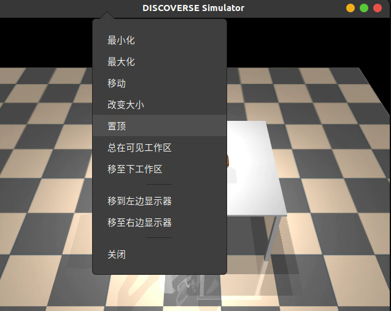

# 自动化数据生成

仿真器相比与真实场景有显著的优势在于可以便捷地获取特权观测，例如在仿真中可以直接获取任意物体的位置、姿态、速度等信息，利用这些信息可以自动化生成原子操作数据。下面以ROS1的手柄操作为例，为plate_coffee_cup任务生成操作策略。

## 前置要求

+   仿真器环境
+   ros1 和 支持ros1的手柄

## 记录操作策略

1.   在`discoverse/examples/ros1/mmk2_joy_ros1.py`中设置操作任务的场景`cfg.mjcf_file_path`

2.   启动

     ```bash
     (terminal 1)
     roscore
     (terminal 2)
     rosrun joy joy_node
     (terminal 3)
     python3 discoverse/examples/ros1/mmk2_joy_ros1.py
     ```

3.   右键标题栏，将显示窗口设置为置顶

     

4.   键鼠操作

     +   左键拖拽：视角旋转
     +   右键拖拽：视角平移
     +   按下滚轮，上下移动鼠标：改变缩放
     +   `[`和`]`切换相机视角
     +   `Esc`切换为自由视角
     +   `Ctrl`+`D`切换深度渲染
     +   `p`打印关键信息

5.   使用手柄进行控制

     +   左摇杆：控制底盘移动
     +   右摇杆：控制头部运动
     +   LT左扳机：升降提高
     +   RT右扳机：升降降低
     +   LB左肩键 （持续按下 控制左侧机械臂）：
         +   方向键 上下：机械臂末端沿x轴平移
         +   方向键 左右：机械臂末端沿y轴平移
         +   左摇杆 上下：机械臂末端沿z轴平移
         +   左摇杆 左右：机械臂末端绕z轴旋转
         +   右摇杆 左右：机械臂末端绕x轴旋转
         +   右摇杆 上下：机械臂末端绕y轴旋转
         +   LT、RT：控制夹爪开合
     +   RB左肩键 （持续按下 控制右侧机械臂）：
         +   操作逻辑同LB。LB、RB可同时按下

6.   记录关键点

     （注意：机器人运动时不会自动避开障碍物，可以考虑利用关键点，将水平面运动与垂直运动分开到不同运动阶段）

     1.   使用手柄操作机器人到关键点，位置尽量精确
     2.   到达关键点后，鼠标点击仿真器窗口，按下`o`键
     3.   终端提示选择相对的物体（若要拿起杯子，则选择杯子；拿起杯子后要放入盘子中，则此时要选盘子），选择后按下回车
     4.   终端提示选择使用的手臂，a 两个手 / l左手 / r右手，选择后按下回车
     5.   设置delay时间，单位秒，直接回车默认不delay
     6.   重复步骤1-5，完成任务并记录所有关键点后，退出仿真器。
     7.   `discoverse/examples/ros1`路径下会生成`scheme_'task_name'.json`

7.   测试策略`scheme_'task_name'.json`

     ```bash
     python discoverse/examples/tasks_mmk2/gendata_from_json.py --task_name task_name --scheme_json /path/to/your/scheme_{task_name}.json --vis
     e.g.
     python discoverse/examples/tasks_mmk2/gendata_from_json.py --task_name plate_coffeecup --scheme_json /path/to/your/scheme_plate_coffeecup.json --vis
     ```

     